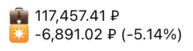
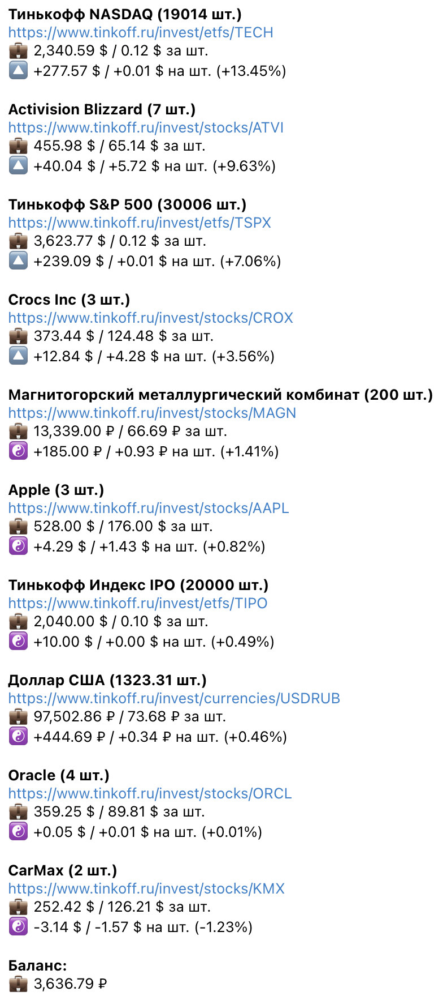

# Tinkoff Portfolio

Бот для Telegram, который поможет следить за состоянием портфеля в Тинькофф Инвестициях

Он отправляет текущий баланс портфеля каждые полчаса, а также имеет команду для получения детального вывода позиций

## Примеры сообщений

### Отчет



### Детали



## Установка

### NPM

```
npm install -g tinkoff-portfolio
```

### Yarn

```
yarn global add tinkoff-portfolio
```

## Использование

```
tinkoff-portfolio --tinkoff-token=[TINKOFF_API_TOKEN] --telegram-token=[TELEGRAM_API_TOKEN] --telegram-chat=[TELEGRAM_CHAT_ID]
```

